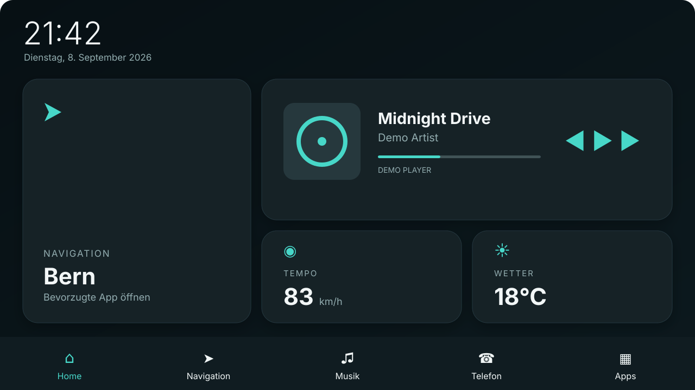
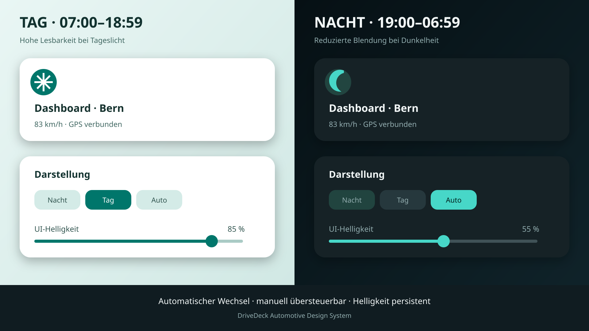
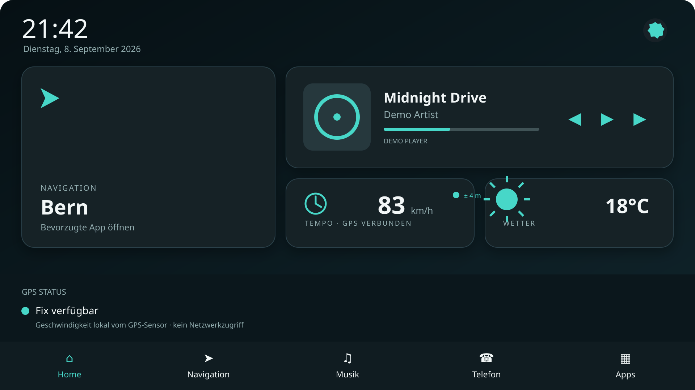
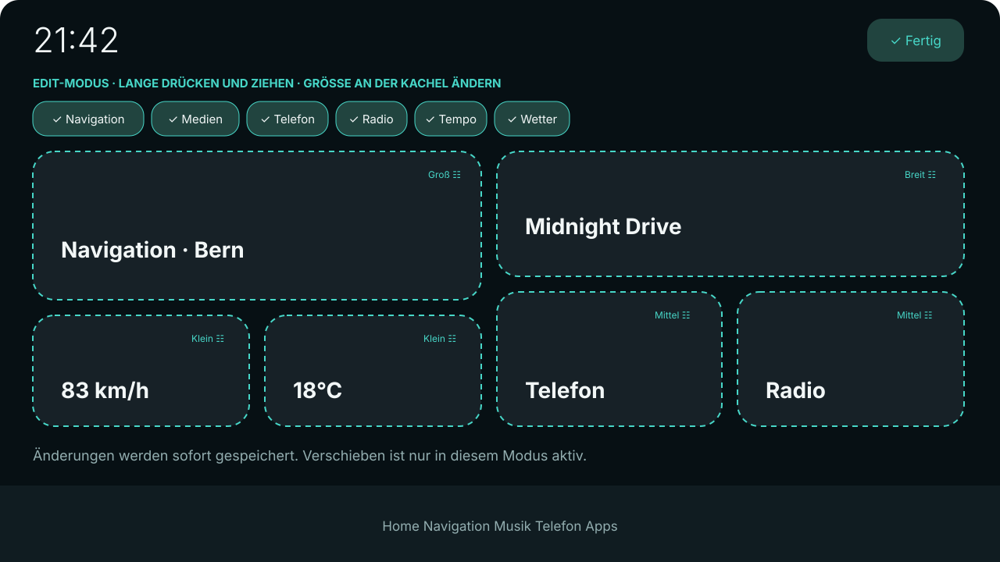
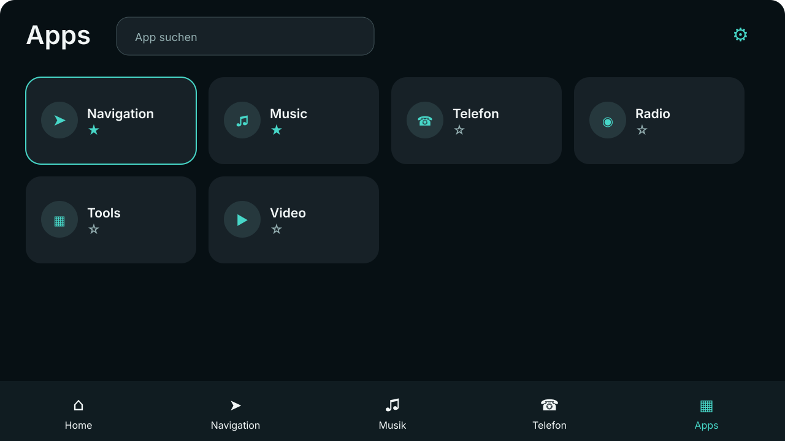
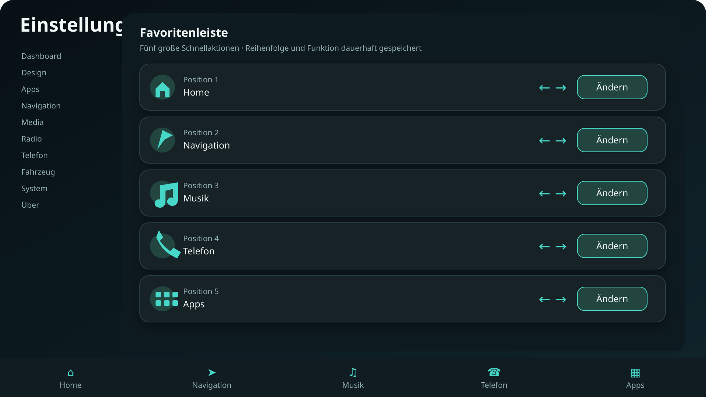

# DriveDeck

DriveDeck ist ein eigenständiger, für Android-Autoradios entwickelter HOME-Launcher. Das Projekt folgt dem Leitbild **„Maximale Funktion mit minimaler Bedienkomplexität“**: große Ziele, hoher Kontrast und die wichtigsten Aktionen in höchstens zwei Berührungen.

## Entwicklungsstand

Die stabile Phase-1-Basis umfasst das responsive Landscape-Dashboard, HOME-Registrierung, App-Übersicht und -Start, persistente Favoriten sowie Design-Einstellungen. Phase 2 ist mit allgemeiner MediaSession-Steuerung, persistenter Dashboard-Anordnung und konfigurierbarer Favoritenleiste umgesetzt. Phase 3 hat mit einer fehlertoleranten GPS-Abstraktion, Berechtigungsführung, GPS-Status und lokaler Geschwindigkeitsanzeige begonnen.

## Screenshots

### Dashboard

[](docs/screenshots/dashboard-preview.svg)

### Automatischer Tag-/Nachtmodus

[](docs/screenshots/day-night-preview.svg)

### GPS und Geschwindigkeit

[](docs/screenshots/gps-dashboard-preview.svg)

### Dashboard-Edit-Modus

[](docs/screenshots/edit-mode-preview.svg)

### App-Auswahl

[](docs/screenshots/apps-preview.svg)

### Konfigurierbare Favoritenleiste

[](docs/screenshots/favorites-settings-preview.svg)

Die Vorschauen sind gültige, skalierbare SVG-1.1-Dateien mit 1280×720 beziehungsweise 1920×1080 Viewport. Sie bleiben bewusst textbasiert, weil der verwendete Pull-Request-Transport keine binären PNG-Dateien akzeptiert. Hinweise zur Darstellung stehen in [`docs/screenshots/README.md`](docs/screenshots/README.md).

## Voraussetzungen

- Android Studio Ladybug oder neuer
- Android SDK 35 (minSdk 29)
- JDK 17
- Gradle 8.10.2 (der CI-Build installiert diese Version automatisch)

## Bauen und testen

```bash
gradle test
gradle lint
gradle assembleDebug
```

Die lokale APK liegt danach unter `app/build/outputs/apk/debug/app-debug.apk`. Jeder GitHub-Actions-Lauf erzeugt zusätzlich eine fortlaufend versionierte Datei wie `DriveDeck-0.3.42-debug.apk` samt SHA-256-Prüfsumme. Beide Dateien stehen 30 Tage im Artifact `DriveDeck-0.3.42-debug` zum Download bereit.

## Installation und HOME-Auswahl

```bash
adb install -r app/build/outputs/apk/debug/app-debug.apk
```

Nach dem Druck auf die Home-Taste DriveDeck auswählen und **Immer** bestätigen. Alternativ führt der Hinweis unter **Einstellungen → System** zu den HOME-Einstellungen. Die Anwendung ist primär für Landscape konfiguriert.

## Architektur

Die Module sind nach Verantwortlichkeit getrennt: `core:model`, `core:preferences` und `core:design` enthalten stabile Grundlagen; `feature:home`, `feature:apps` und `feature:settings` enthalten UI und ViewModels; `app` bildet den Composition Root. Details stehen in [ARCHITECTURE.md](ARCHITECTURE.md), Entscheidungen in [`docs/decisions`](docs/decisions) und der Plan in [ROADMAP.md](ROADMAP.md).

## Bekannte Einschränkungen

- Der Medienzugriff muss einmalig in den Android-Einstellungen freigegeben werden; ohne Freigabe zeigt die Medienkarte klar bezeichnete Preview-Daten und deaktiviert die Steuerung.
- Navigation, Telefon und Radio besitzen noch keine eigenen Provider; ihre Schnellaktionen führen aktuell zur sicheren App-Auswahl.
- Dashboard Drag & Drop, GPS, Day/Night-Automatik und Headunit-Adapter sind für spätere Phasen geplant.
- Manche Hersteller-ROMs behandeln die HOME-Auswahl anders als AOSP.

## Mitarbeit

Entwicklung erfolgt über kurze Feature-Branches und Pull Requests gegen `main`. Änderungen müssen Tests, Lint und den Debug-Build bestehen.
